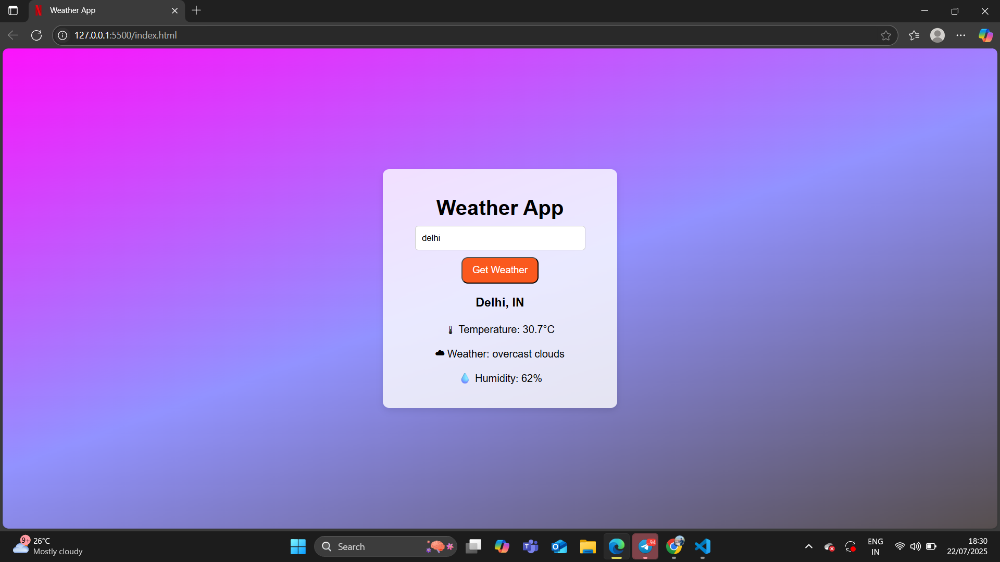

# 🌦 Weather App

A simple weather application built with **HTML, CSS, and JavaScript**, which uses the **OpenWeatherMap API** to fetch real-time weather data.

---

## 🚀 Features
- Search weather by city name.
- Displays:
  - 🌡 **Temperature (°C)**
  - ☁ **Weather description** (e.g., Clear, Rain, Clouds)
  - 💧 **Humidity**
- Error handling for invalid city names.
- Clean and responsive UI.

---

## 🛠 Tech Stack
- **HTML5**
- **CSS3**
- **JavaScript (ES6+)**
- **OpenWeatherMap API**

---

---

## 🌐 Live Demo
[Click Here to View Live Demo]()

---

## 📂 Project Structure

weather-app/
│── index.html
│── style.css
│── script.js
└── README.md

---

## ✨ Future Enhancements
Add 5-day weather forecast.

Show weather icons dynamically.

Add dark mode.

Make UI mobile-friendly with better responsiveness.

